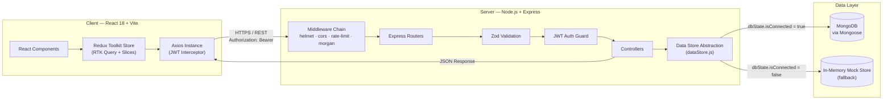
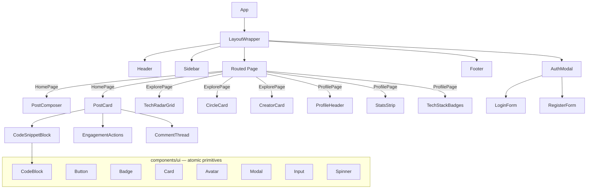
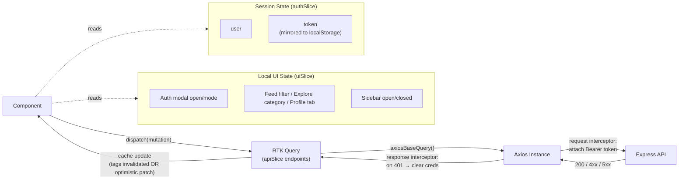
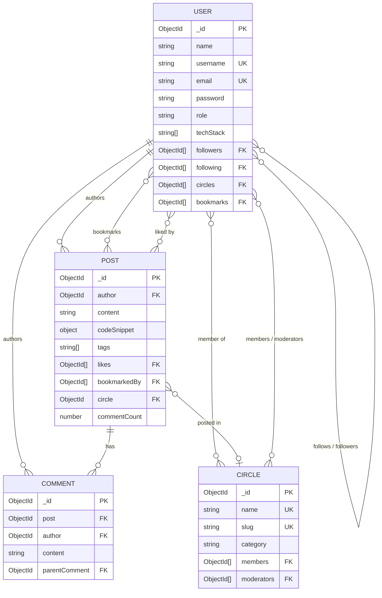
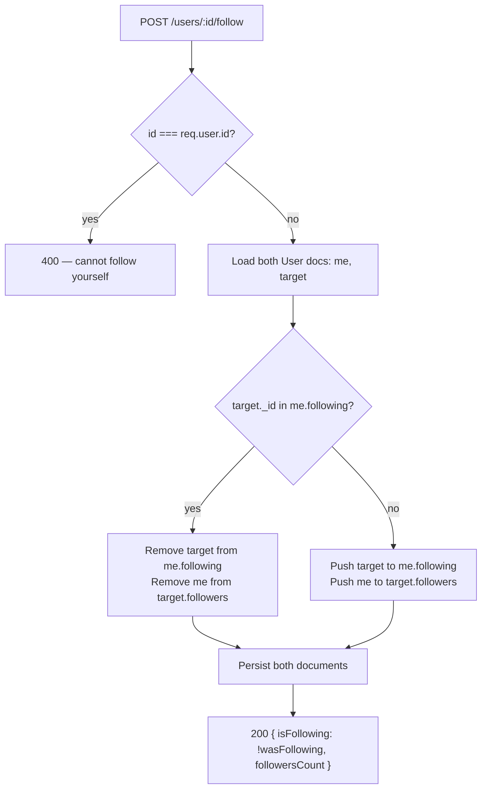
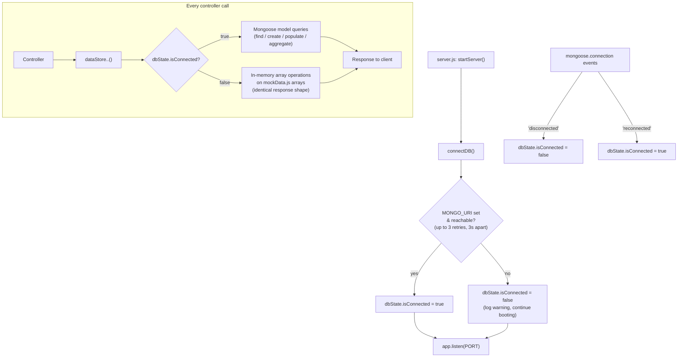
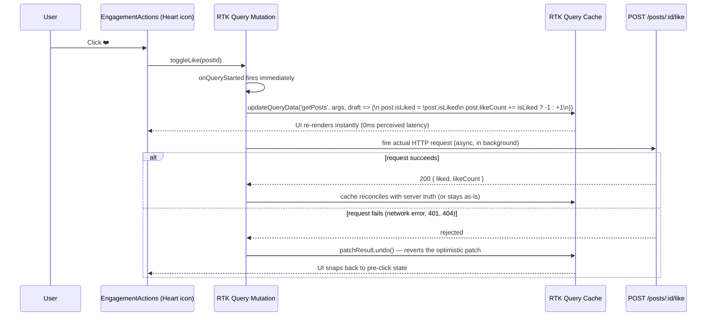

# 🧠 PROJECT_BRAIN.md — Feedants Technical Specification Blueprint

| | |
|---|---|
| **Project** | Feedants — Developer & Creator Network Platform |
| **Stack** | MERN (MongoDB · Express · React · Node.js) + Redux Toolkit |
| **Document type** | Single Source of Truth (SSOT) — Architecture, API Contracts, Data Models, System Flows |
| **Status** | Living document — update alongside code changes |

---

## Table of Contents

1. [Project Architecture & Directory Mapping](#1-project-architecture--directory-mapping)
2. [Comprehensive API Specification](#2-comprehensive-api-specification)
3. [Database Schemas & Data Models](#3-database-schemas--data-models)
4. [End-to-End System Flow & State Machines](#4-end-to-end-system-flow--state-machines)
5. [Environment Variables & Security Matrix](#5-environment-variables--security-matrix)

---

## 1. Project Architecture & Directory Mapping

### 1.1 High-Level System Architecture



**Relationship summary**

- **Client** never talks to the database directly. It only ever calls the Express REST API (`/api/v1/*`) through a single shared Axios instance.
- **Server** never lets a route handler decide storage strategy — every controller calls into `utils/dataStore.js`, which is the *only* module aware of whether MongoDB is live or mocked (`config/db.js` → `dbState.isConnected`).
- **Database layer** is pluggable: a live MongoDB instance or a seeded in-memory JS store (`utils/mockData.js`) — API contracts are identical either way.

### 1.2 Repository Structure

```
feedants-app/
├── backend/
│   ├── config/db.js                 # Mongo connection + dbState.isConnected flag
│   ├── controllers/                 # authController, postController, userController, circleController
│   ├── middlewares/                 # auth (JWT guard), validate (Zod), errorHandler, asyncWrapper
│   ├── models/                      # User, Post, Comment, Circle (Mongoose schemas)
│   ├── routes/                      # authRoutes, postRoutes, userRoutes, circleRoutes
│   ├── utils/                       # dataStore.js, mockData.js, seed.js, ApiError.js, generateToken.js
│   ├── validators/                  # Zod schemas: authValidators, postValidators, circleValidators
│   └── server.js                    # Express app entry point
│
└── frontend/
    └── src/
        ├── components/
        │   ├── ui/                  # Button, Badge, Card, Avatar, Modal, Input, CodeBlock, Spinner
        │   ├── common/               # Header, Footer, Sidebar, LayoutWrapper, ProtectedRoute
        │   ├── feed/                 # PostComposer, PostCard, CodeSnippetBlock, EngagementActions, CommentThread
        │   ├── explore/               # TechRadarGrid, CircleCard, CreatorCard
        │   ├── profile/               # ProfileHeader, StatsStrip, TechStackBadges
        │   └── auth/                  # AuthModal, LoginForm, RegisterForm
        ├── hooks/                     # useAuth, useDebounce, useCopyClipboard, useTheme
        ├── pages/                      # HomePage, ExplorePage, ProfilePage, AuthPage, SettingsPage, BookmarksPage, NotFoundPage
        ├── services/axiosInstance.js  # JWT injection + 401 auto-logout interceptors
        ├── store/
        │   ├── store.js
        │   ├── slices/                 # authSlice (persisted session), uiSlice (modals/tabs/filters)
        │   └── api/                     # apiSlice (base), authApi, postsApi, usersApi, circlesApi
        └── utils/                      # formatters, validation, constants, cn
```

### 1.3 Frontend Component Hierarchy



- **`ui/`** — Presentational, stateless primitives. No API calls, no Redux access. Styled via Tailwind design tokens.
- **`common/`** — Layout shells and cross-cutting concerns (nav, auth gating). Composes `ui/` + connects to `uiSlice`/`authSlice`.
- **`feed/`, `explore/`, `profile/`, `auth/`** — Domain/feature components. Each owns its RTK Query hook calls (`useGetPostsQuery`, `useToggleLikePostMutation`, etc.) and composes `ui/` primitives.

### 1.4 State Management Flow



| Layer | Responsibility | Key file |
|---|---|---|
| **RTK Query (`store/api/*.js`)** | Server-state cache: fetching, caching, tag-based invalidation, optimistic updates | `apiSlice.js` + 4 injected endpoint files |
| **Axios instance** | Transport layer shared by every RTK Query call; owns JWT injection and 401 handling | `services/axiosInstance.js` |
| **`authSlice`** | Client-side session mirror (`user`, `token`, `isAuthenticated`), persisted to `localStorage` | `store/slices/authSlice.js` |
| **`uiSlice`** | Ephemeral UI state not worth server round-trips (active tab, modal visibility, theme) | `store/slices/uiSlice.js` |

---

## 2. Comprehensive API Specification

**Base URL:** `{API_BASE_URL}/api/v1` (default `http://localhost:5000/api/v1`)
**Auth header:** `Authorization: Bearer <JWT>`
**Standard success envelope:** `{ "success": true, "data": ..., "message"?: string, "pagination"?: {...} }`
**Standard error envelope:** `{ "success": false, "message": string, "details"?: string[] }`

### 2.1 Auth — `/auth`

#### `POST /auth/register`
| | |
|---|---|
| **Auth** | Public |
| **Request body** | `{ "name": string(2-60), "username": string(3-30, /^[a-z0-9_]+$/), "email": string(email), "password": string(min 8, ≥1 uppercase, ≥1 digit) }` |
| **Success 201** | `{ "success": true, "message": "Account created successfully", "data": { "user": <PublicUser>, "token": string } }` |
| **Error 409** | `{ "success": false, "message": "An account with this email/username already exists" }` |
| **Error 400** | `{ "success": false, "message": "Validation failed", "details": string[] }` |
| **Business logic** | `dataStore.users.existsByEmailOrUsername()` pre-check → `dataStore.users.create()` → password hashed with **bcrypt, 12 salt rounds** (Mongoose `pre('save')` hook) or **10 rounds** in mock mode → `generateToken(userId)` signs JWT → response strips `password` field via `toPublicJSON()` / `pickPublicUser()`. |

#### `POST /auth/login`
| | |
|---|---|
| **Auth** | Public |
| **Request body** | `{ "email": string(email), "password": string(min 1) }` |
| **Success 200** | `{ "success": true, "message": "Signed in successfully", "data": { "user": <PublicUser>, "token": string } }` |
| **Error 401** | `{ "success": false, "message": "Invalid email or password" }` (generic on both bad-email and bad-password to avoid user enumeration) |
| **Business logic** | `dataStore.users.findByEmail(email, { withPassword: true })` → `user.comparePassword()` (bcrypt compare) → `generateToken()`. |

#### `GET /auth/me`
| | |
|---|---|
| **Auth** | 🔒 Protected |
| **Request** | No body |
| **Success 200** | `{ "success": true, "data": { "user": <PublicUser> } }` |
| **Error 401** | `{ "success": false, "message": "Not authorized — invalid or expired token" }` |
| **Business logic** | `protect` middleware verifies JWT → `dataStore.users.findById(req.user.id)`. |

#### `POST /auth/logout`
| | |
|---|---|
| **Auth** | 🔒 Protected |
| **Success 200** | `{ "success": true, "message": "Signed out successfully" }` |
| **Business logic** | Stateless JWT — logout is a client-side token discard (`localStorage.removeItem`); endpoint exists for symmetry / future cookie-based sessions. |

---

### 2.2 Posts — `/posts`

#### `GET /posts`
| | |
|---|---|
| **Auth** | Public (optional token — enables `isLiked`/`isBookmarked` flags via `attachUserIfPresent`) |
| **Query params** | `page?: number=1, limit?: number=10 (max 50), tag?: string, circle?: ObjectId, author?: ObjectId, search?: string` |
| **Success 200** | `{ "success": true, "data": Post[], "pagination": { "page": number, "limit": number, "total": number, "pages": number } }` |
| **Business logic** | `dataStore.posts.list()` filters by `isPublished: true` + optional `tags`, `circle`, `author`, `$text` search; sorted `createdAt: -1`; `.populate('author')` + `.populate('circle')` in live mode. Each post is hydrated with `isLiked`/`isBookmarked` relative to `req.user?.id`. |

#### `POST /posts`
| | |
|---|---|
| **Auth** | 🔒 Protected |
| **Request body** | `{ "content": string(1-4000), "codeSnippet"?: { "code": string(≤20000), "language": string, "filename": string } \| null, "image"?: string, "tags"?: string[](≤10), "circle"?: ObjectId \| null }` |
| **Success 201** | `{ "success": true, "message": "Post published", "data": <Post> }` |
| **Error 400** | `{ "success": false, "message": "Validation failed", "details": [...] }` |
| **Business logic** | `dataStore.posts.create()` — `author` set from `req.user.id`; `tags` lower-cased/deduped via schema `set()` transform; new post prepended to feed. |

#### `GET /posts/:id`
| | |
|---|---|
| **Auth** | Public (optional token) |
| **Success 200** | `{ "success": true, "data": <Post> }` |
| **Error 404** | `{ "success": false, "message": "Post not found" }` |

#### `PATCH /posts/:id`
| | |
|---|---|
| **Auth** | 🔒 Protected — **owner only** |
| **Request body** | Partial of `createPostSchema` (any subset of `content`, `codeSnippet`, `image`, `tags`, `circle`) |
| **Success 200** | `{ "success": true, "message": "Post updated", "data": <Post> }` |
| **Error 403** | `{ "success": false, "message": "You can only edit your own posts" }` |
| **Error 404** | `{ "success": false, "message": "Post not found" }` |

#### `DELETE /posts/:id`
| | |
|---|---|
| **Auth** | 🔒 Protected — **owner only** |
| **Success 200** | `{ "success": true, "message": "Post deleted" }` |
| **Error 403 / 404** | Same ownership rules as `PATCH`. |

#### `POST /posts/:id/like`
| | |
|---|---|
| **Auth** | 🔒 Protected |
| **Success 200** | `{ "success": true, "data": { "liked": boolean, "likeCount": number } }` |
| **Error 404** | `{ "success": false, "message": "Post not found" }` |
| **Business logic** | Toggle: if `userId` present in `post.likes` → remove (unlike); else push (like). Idempotent per click. **Frontend optimistic update** — see [§4.3](#43-optimistic-ui-update-sequence). |

#### `POST /posts/:id/bookmark`
| | |
|---|---|
| **Auth** | 🔒 Protected |
| **Success 200** | `{ "success": true, "data": { "bookmarked": boolean } }` |
| **Business logic** | Toggles `post.bookmarkedBy` **and** `user.bookmarks` symmetrically in a single operation. |

#### `GET /posts/:id/comments`
| | |
|---|---|
| **Auth** | Public |
| **Success 200** | `{ "success": true, "data": Comment[] }` (sorted `createdAt: -1`, author populated) |

#### `POST /posts/:id/comments`
| | |
|---|---|
| **Auth** | 🔒 Protected |
| **Request body** | `{ "content": string(1-1000), "parentComment"?: ObjectId \| null }` |
| **Success 201** | `{ "success": true, "message": "Comment added", "data": <Comment> }` |
| **Error 404** | `{ "success": false, "message": "Post not found" }` |
| **Business logic** | Creates `Comment` doc → increments `post.commentCount` and pushes to `post.comments[]`. |

#### `GET /posts/trending/tags`
| | |
|---|---|
| **Auth** | Public |
| **Query params** | `limit?: number=6 (max 20)` |
| **Success 200** | `{ "success": true, "data": [{ "tag": string, "count": number }] }` |
| **Business logic** | Live mode: `$unwind` → `$group` → `$sort` → `$limit` aggregation pipeline on `Post.tags`. Mock mode: in-memory tally over `mockPosts`. |

---

### 2.3 Users — `/users`

#### `GET /users/search`
| | |
|---|---|
| **Auth** | Public |
| **Query params** | `q: string` (min 2 chars; returns `[]` below that) |
| **Success 200** | `{ "success": true, "data": PublicUser[] }` (max 10) |
| **Business logic** | Live: MongoDB `$text` search on `name/username/bio` text index. Mock: case-insensitive substring match on `name`/`username`. |

#### `GET /users/creators`
| | |
|---|---|
| **Auth** | Public |
| **Query params** | `limit?: number=10 (max 30)` |
| **Success 200** | `{ "success": true, "data": PublicUser[] }` |
| **Business logic** | Filters `role IN ['creator', 'staff']` — powers the Explore page's "Curated Technical Creators" section. |

#### `PATCH /users/me`
| | |
|---|---|
| **Auth** | 🔒 Protected |
| **Request body** | `{ name?, title?, company?, location?, bio?, website?, avatar?, coverImage?, techStack?: string[], socials?: { github?, twitter?, linkedin? } }` (strict schema — unknown keys rejected) |
| **Success 200** | `{ "success": true, "message": "Profile updated", "data": { "user": <PublicUser> } }` |
| **Business logic** | `dataStore.users.updateById(req.user.id, req.body)`. |

#### `POST /users/:id/follow`
| | |
|---|---|
| **Auth** | 🔒 Protected |
| **Success 200** | `{ "success": true, "data": { "isFollowing": boolean, "followersCount": number } }` |
| **Error 400** | `{ "success": false, "message": "You cannot follow yourself" }` |
| **Error 404** | `{ "success": false, "message": "User not found" }` |
| **Business logic** | Symmetric toggle across both users: `me.following[]` ↔ `target.followers[]`, persisted atomically per data-source mode. |

#### `GET /users/:username`
| | |
|---|---|
| **Auth** | Public (optional token — resolves `isFollowing`) |
| **Success 200** | `{ "success": true, "data": { "user": <PublicUser & { isFollowing }>, "posts": Post[], "stats": { "postCount", "followersCount", "followingCount" } } }` |
| **Error 404** | `{ "success": false, "message": "User not found" }` |
| **Business logic** | Fetches user by `username` → fetches that user's posts (`dataStore.posts.list({ author: userId, limit: 20 })`) → computes `isFollowing` against the requesting user if authenticated. |

---

### 2.4 Circles — `/circles`

#### `GET /circles`
| | |
|---|---|
| **Auth** | Public |
| **Query params** | `category?: string` (one of the 10 enum values, see [§3.4](#34-circle-model)) |
| **Success 200** | `{ "success": true, "data": Circle[] }` (sorted by `memberCount` desc) |

#### `POST /circles`
| | |
|---|---|
| **Auth** | 🔒 Protected |
| **Request body** | `{ "name": string(2-80), "description"?: string(≤400), "category": enum, "icon"?: string="groups", "color"?: string="#533afd" }` |
| **Success 201** | `{ "success": true, "message": "Circle created", "data": <Circle> }` |
| **Error 409** | `{ "success": false, "message": "A circle with a similar name already exists" }` |
| **Business logic** | Slug auto-derived from `name` (lower-cased, non-alphanumeric → `-`); creator is auto-added to `members[]` and `moderators[]`. |

#### `GET /circles/:idOrSlug`
| | |
|---|---|
| **Auth** | Public |
| **Success 200** | `{ "success": true, "data": <Circle> }` |
| **Error 404** | `{ "success": false, "message": "Circle not found" }` |
| **Business logic** | Tries `getById` first (catches `CastError` on non-ObjectId strings), falls back to `getBySlug`. |

#### `POST /circles/:id/join`
| | |
|---|---|
| **Auth** | 🔒 Protected |
| **Success 200** | `{ "success": true, "data": { "joined": boolean, "memberCount": number } }` |
| **Error 404** | `{ "success": false, "message": "Circle not found" }` |
| **Business logic** | Toggles membership in `circle.members[]`. **Frontend optimistic update** mirrors this in the `getCircles` RTK Query cache. |

---

### 2.5 System

#### `GET /health`
| | |
|---|---|
| **Auth** | Public |
| **Success 200** | `{ "success": true, "message": "Feedants API is running", "dataSource": "mongodb" \| "in-memory-mock", "timestamp": ISODate }` |
| **Business logic** | Reads `dbState.isConnected` directly — the single canonical way to check which storage backend is currently active. |

### 2.6 Endpoint Index (Quick Reference)

| Method | Route | Auth |
|---|---|---|
| POST | `/auth/register` | Public |
| POST | `/auth/login` | Public |
| GET | `/auth/me` | 🔒 |
| POST | `/auth/logout` | 🔒 |
| GET | `/posts` | Public* |
| POST | `/posts` | 🔒 |
| GET | `/posts/:id` | Public* |
| PATCH | `/posts/:id` | 🔒 owner |
| DELETE | `/posts/:id` | 🔒 owner |
| POST | `/posts/:id/like` | 🔒 |
| POST | `/posts/:id/bookmark` | 🔒 |
| GET | `/posts/:id/comments` | Public |
| POST | `/posts/:id/comments` | 🔒 |
| GET | `/posts/trending/tags` | Public |
| GET | `/users/search` | Public |
| GET | `/users/creators` | Public |
| PATCH | `/users/me` | 🔒 |
| POST | `/users/:id/follow` | 🔒 |
| GET | `/users/:username` | Public* |
| GET | `/circles` | Public |
| POST | `/circles` | 🔒 |
| GET | `/circles/:idOrSlug` | Public |
| POST | `/circles/:id/join` | 🔒 |
| GET | `/health` | Public |

`*` = optional auth via `attachUserIfPresent` (never rejects; enriches response when a valid token is present).

---

## 3. Database Schemas & Data Models

### 3.1 Entity Relationship Overview



### 3.2 User Model (`models/User.js`)

| Field | Type | Validation / Rules | Notes |
|---|---|---|---|
| `name` | String | required, trim, 2–60 chars | |
| `username` | String | required, **unique**, lowercase, trim, 3–30 chars, `/^[a-z0-9_]+$/` | Indexed for lookups |
| `email` | String | required, **unique**, lowercase, trim, email regex | Indexed for lookups |
| `password` | String | required, min 8 chars, `select: false` | Never returned by default queries; hashed via bcrypt (12 rounds) in `pre('save')` hook |
| `avatar` | String | default `''` | |
| `coverImage` | String | default `''` | |
| `role` | String | enum: `member \| creator \| staff \| admin`, default `member` | Drives "Curated Creators" eligibility (`creator`/`staff`) |
| `title`, `company`, `location` | String | max 120 / 80 / 80 chars | |
| `bio` | String | max 500 chars | |
| `website` | String | default `''` | |
| `socials` | Object | `{ github, twitter, linkedin }` | |
| `techStack` | String[] | default `[]` | |
| `followers` / `following` | ObjectId[] → `User` | default `[]` | Symmetric — see [§4.1](#toggle-follow-logic) |
| `circles` | ObjectId[] → `Circle` | default `[]` | |
| `bookmarks` | ObjectId[] → `Post` | default `[]` | |
| `verified` | Boolean | default `false` | Renders `BadgeCheck` in UI |
| `isActive` | Boolean | default `true` | |
| `lastActiveAt` | Date | default `now` | |
| `createdAt` / `updatedAt` | Date | auto (`timestamps: true`) | |

**Virtuals:** `followersCount`, `followingCount` (computed from array length, exposed via `toJSON`/`toObject`).

**Indexes:**
- `{ username: 1 }` — implicit via `unique: true`
- `{ email: 1 }` — implicit via `unique: true`
- `{ name: 'text', username: 'text', bio: 'text' }` — powers `GET /users/search`

**Instance methods:**
- `comparePassword(candidate)` → `bcrypt.compare()`
- `toPublicJSON()` → strips `password` and `__v` before sending to the client

---

### 3.3 Post Model (`models/Post.js`)

| Field | Type | Validation / Rules | Notes |
|---|---|---|---|
| `author` | ObjectId → `User` | required | |
| `content` | String | required, trim, max 4000 chars | |
| `codeSnippet` | Sub-document \| `null` | `{ code: String, language: String, filename: String }` | Embedded, not referenced — 1:1 with its post |
| `image` | String | default `''` | |
| `tags` | String[] | default `[]`; **schema-level `set()` transform** lower-cases + trims + filters empty | |
| `circle` | ObjectId → `Circle` \| `null` | default `null` | |
| `likes` | ObjectId[] → `User` | default `[]` | |
| `bookmarkedBy` | ObjectId[] → `User` | default `[]` | |
| `comments` | ObjectId[] → `Comment` | default `[]` | Comments also carry their own `post` back-reference |
| `commentCount` | Number | default `0` | Denormalized counter, incremented on comment creation |
| `shareCount` / `viewCount` | Number | default `0` | |
| `isPublished` | Boolean | default `true` | `GET /posts` filters on this |
| `createdAt` / `updatedAt` | Date | auto | |

**Virtuals:** `likeCount` (from `likes.length`).

**Indexes:**
- `{ tags: 1 }` — tag filtering
- `{ createdAt: -1 }` — feed sort order
- `{ content: 'text', tags: 'text' }` — full-text `search` query param

**Response-time enrichment (not persisted):** `isLiked`, `isBookmarked` — computed per-request in `postController.attachIsLiked()` relative to the requesting user.

---

### 3.4 Circle Model (`models/Circle.js`)

| Field | Type | Validation / Rules | Notes |
|---|---|---|---|
| `name` | String | required, trim, **unique**, max 80 chars | |
| `slug` | String | **unique**, lowercase, trim | Auto-derived from `name` in `pre('validate')` hook |
| `description` | String | max 400 chars | |
| `category` | String | **enum**: `AI & Infra \| Frontend Architecture \| Low-Latency & WASM \| Systems & Backend \| Open Source \| Mobile \| DevOps & Cloud \| Security \| Data & ML \| Other`, default `Other` | |
| `icon` | String | default `'groups'` | Material Symbols icon name |
| `color` | String | default `'#533afd'` | Hex — matches primary brand indigo |
| `members` | ObjectId[] → `User` | default `[]` | |
| `moderators` | ObjectId[] → `User` | default `[]` | |
| `postCount` | Number | default `0` | |
| `createdAt` / `updatedAt` | Date | auto | |

**Virtuals:** `memberCount` (from `members.length`).

---

### 3.5 Comment Model (`models/Comment.js`)

| Field | Type | Validation / Rules | Notes |
|---|---|---|---|
| `post` | ObjectId → `Post` | required | |
| `author` | ObjectId → `User` | required | |
| `content` | String | required, trim, max 1000 chars | |
| `likes` | ObjectId[] → `User` | default `[]` | Schema supports comment-likes; no endpoint currently exposes it (roadmap item) |
| `parentComment` | ObjectId → `Comment` \| `null` | default `null` | Enables threaded replies (schema-ready, flat rendering in current UI) |
| `createdAt` / `updatedAt` | Date | auto | |

**Virtuals:** `likeCount`.

---

## 4. End-to-End System Flow & State Machines

### 4.1 Authentication Flow

```mermaid
sequenceDiagram
    participant U as User (Browser)
    participant F as React Component
    participant RTK as RTK Query (authApi)
    participant AX as Axios Instance
    participant API as Express API
    participant DB as Data Store

    U->>F: Submit login form
    F->>RTK: useLoginMutation({ email, password })
    RTK->>AX: POST /auth/login
    AX->>API: HTTP request
    API->>API: validate(loginSchema) — Zod
    API->>DB: users.findByEmail(email, { withPassword: true })
    DB-->>API: user document (incl. hashed password)
    API->>API: user.comparePassword(password) — bcrypt.compare
    alt password matches
        API->>API: generateToken(userId) — jwt.sign, 7d expiry
        API-->>AX: 200 { user, token }
        AX-->>RTK: response.data
        RTK->>F: dispatch(setCredentials({ user, token }))
        F->>F: localStorage.setItem('feedants_token', token)
        F->>F: localStorage.setItem('feedants_user', JSON.stringify(user))
        F->>U: Close AuthModal, render authenticated header
    else password mismatch / user not found
        API-->>AX: 401 { message: "Invalid email or password" }
        AX-->>RTK: rejected promise
        RTK->>F: loginError populated
        F->>U: Inline error message
    end

    Note over U,API: Every subsequent request
    F->>AX: any API call
    AX->>AX: request interceptor:<br/>headers.Authorization = "Bearer " + localStorage token
    AX->>API: authenticated request
    API->>API: protect middleware — jwt.verify()
    alt token invalid/expired
        API-->>AX: 401
        AX->>AX: response interceptor:<br/>clear localStorage, call onUnauthorized()
        AX->>F: App.jsx handler:<br/>dispatch(clearCredentials()); navigate('/auth')
    end
```

**Key implementation points:**
- Passwords are **never** stored or transmitted in plaintext beyond the initial HTTPS request body; hashed immediately via bcrypt (12 rounds live / 10 rounds mock) before persistence.
- JWT payload is minimal (`{ id: userId }`) — all other user data is re-fetched server-side per request via `dataStore.users.findById()`, so a stale token can't leak stale profile data.
- The frontend's `registerUnauthorizedHandler` (wired in `App.jsx`) is the **single choke point** for 401 handling — no component needs its own logout-on-401 logic.

#### Toggle-Follow Logic



### 4.2 Data Ingestion & Mongo/Mock Fallback Mechanism



**Why this matters:** Controllers (`postController.js`, `userController.js`, `circleController.js`, `authController.js`) contain **zero branching logic** for data source — they call `dataStore.posts.list()`, `dataStore.users.create()`, etc. and get back identically-shaped data whether MongoDB is live or not. This is enforced by every `dataStore` namespace method internally checking `isLive()` (`dbState.isConnected`) and choosing the Mongoose path or the mock path, then normalizing the return shape (e.g. `hydratePost()`, `pickPublicUser()` mimic what `.populate()` / `toJSON` virtuals would produce).

`GET /health` is the only endpoint that exposes `dataSource` directly, for observability.

### 4.3 Optimistic UI Update Sequence

Applies identically to **Like** (`useToggleLikePostMutation`), **Bookmark** (`useToggleBookmarkPostMutation`), **Follow** (`useToggleFollowUserMutation`), and **Circle Join** (`useToggleJoinCircleMutation`) — all implemented with the same RTK Query `onQueryStarted` pattern.



**Implementation pattern** (from `store/api/postsApi.js`):
1. Enumerate every currently-cached `getPosts` query variant via `apiSlice.util.selectCachedArgsForQuery(getState(), 'getPosts')` — because the same post can appear in multiple cached pages/filters simultaneously (feed, profile, explore-by-tag).
2. Patch each matching cache entry with `postsApi.util.updateQueryData(...)`, collecting an `undo()` handle per patch.
3. `await queryFulfilled` — on rejection, call every collected `undo()` to roll back atomically.
4. No `invalidatesTags` is used for these toggles (unlike `createPost`/`deletePost`) — the cache patch **is** the update; a full refetch would defeat the purpose of optimism.

---

## 5. Environment Variables & Security Matrix

### 5.1 Backend `.env`

| Variable | Required | Default | Description |
|---|---|---|---|
| `NODE_ENV` | No | `development` | Toggles Morgan log format (`dev` vs `combined`) and stack-trace exposure in error responses |
| `PORT` | No | `5000` | Express listen port |
| `CLIENT_URL` | Yes (prod) | `http://localhost:5173` | Sole allowed CORS origin |
| `MONGO_URI` | No | *(unset → mock mode)* | MongoDB connection string; 3 connection retries with 3s backoff before falling back |
| `JWT_SECRET` | **Yes** | *(none — must be set)* | HMAC signing secret for all issued tokens. **Rotate before production deploy.** |
| `JWT_EXPIRES_IN` | No | `7d` | Token lifetime passed to `jwt.sign()` |
| `RATE_LIMIT_WINDOW_MS` | No | `900000` (15 min) | `express-rate-limit` window |
| `RATE_LIMIT_MAX` | No | `300` | Max requests per IP per window, applied to all `/api/*` routes |

### 5.2 Frontend `.env`

| Variable | Required | Default | Description |
|---|---|---|---|
| `VITE_API_BASE_URL` | No | `http://localhost:5000/api/v1` | Base URL for every Axios/RTK Query request |

### 5.3 Security Measures Implemented

| Control | Implementation | Location |
|---|---|---|
| **Password hashing** | bcrypt, **12 salt rounds** (live) / 10 rounds (mock), applied in Mongoose `pre('save')` hook — never done in controllers | `models/User.js`, `utils/dataStore.js` |
| **Password field exposure** | `select: false` at schema level; explicit `.select('+password')` only in the login path | `models/User.js` |
| **Transport security headers** | `helmet()` — sets `X-Content-Type-Options`, `X-Frame-Options`, CSP defaults, etc. | `server.js` |
| **CORS** | Locked to a single `CLIENT_URL` origin, `credentials: true` | `server.js` |
| **Rate limiting** | `express-rate-limit` — 300 req / 15 min / IP across all `/api` routes (tunable via env) | `server.js` |
| **JWT verification** | `protect` middleware — rejects missing/invalid/expired tokens before any controller logic runs | `middlewares/auth.js` |
| **Ownership authorization** | Post edit/delete re-checks `post.author === req.user.id` server-side (never trusts client-supplied ownership) | `controllers/postController.js`, `utils/dataStore.js` |
| **Input validation** | Zod schemas on every mutating route — rejects unknown/malformed payloads before they reach a controller | `middlewares/validate.js`, `validators/*.js` |
| **Generic auth errors** | Login returns the same 401 message for "no such user" and "wrong password" to prevent user enumeration | `controllers/authController.js` |
| **Body size limits** | `express.json({ limit: '2mb' })` — mitigates oversized-payload DoS | `server.js` |
| **Centralized error normalization** | `errorHandler` middleware maps Mongoose `CastError`/`ValidationError`/duplicate-key, JWT errors, and Zod `ZodError` into consistent, non-leaky HTTP responses; stack traces only in `NODE_ENV=development` | `middlewares/errorHandler.js` |
| **Client-side token storage** | JWT in `localStorage` (not `httpOnly` cookie in current build — see Roadmap) | `store/slices/authSlice.js` |

### 5.4 Known Gaps / Roadmap Candidates

- Migrate JWT storage from `localStorage` to an `httpOnly` secure cookie to reduce XSS token-theft surface.
- Add refresh-token rotation (current tokens are long-lived, 7d, with no revocation list).
- Expose comment-like endpoint (schema already supports `Comment.likes[]`).
- Add per-route granular rate limits (auth endpoints currently share the global 300/15min budget — brute-force login attempts warrant a stricter limit).

---

*Document generated against the Feedants codebase as of the MERN scaffold build. Keep this file adjacent to the repo root and update it whenever a route, schema, or auth flow changes.*